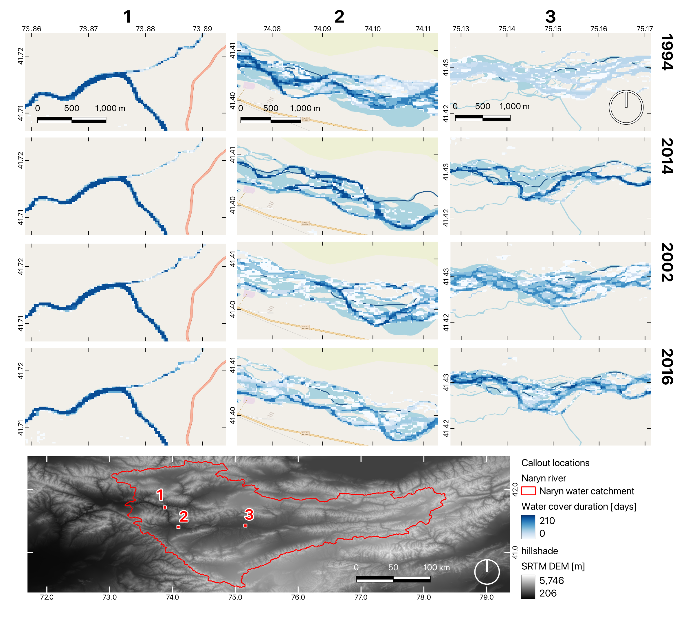
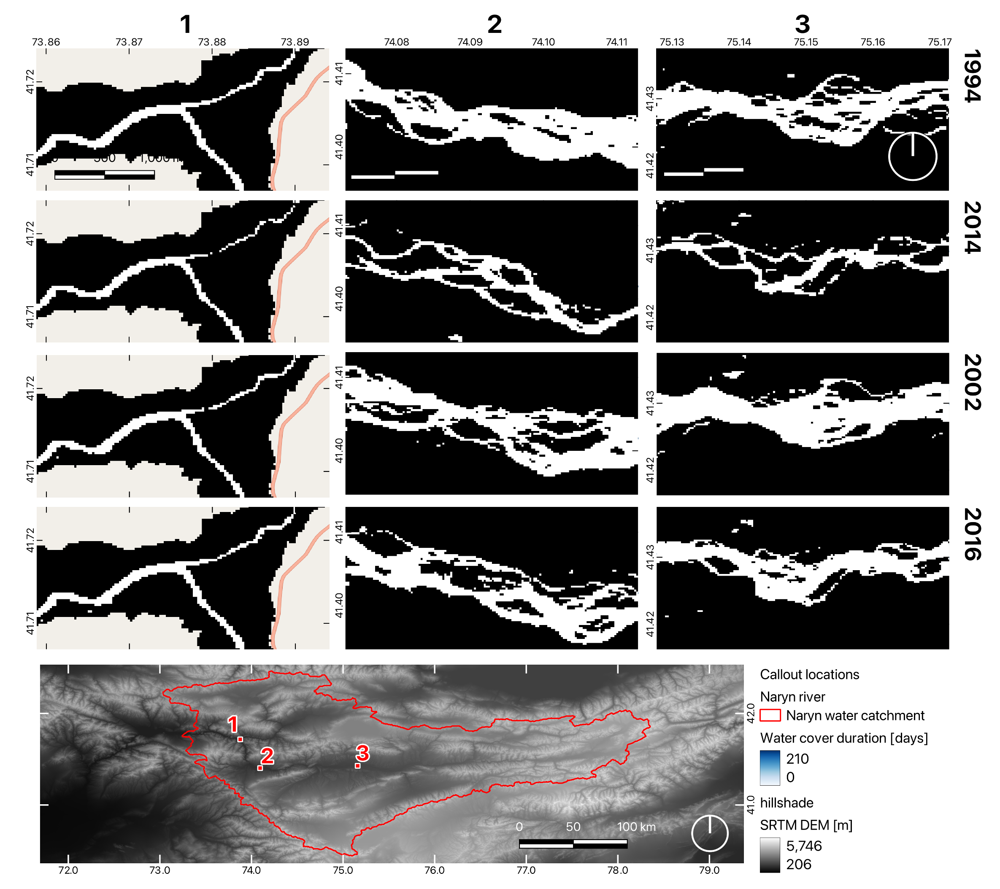

# CC-riverdynamics
Tracking river dynamics using dense time series in Google Earth Engine.
Find the GEE code here https://code.earthengine.google.com/a44ce656ffbadf2dd2667eed00e8daf4 and in the GEE_code file.

Taking advantage of the long time series of the Landsat data archive and its high spatial resolution, this study aimed to create flood maps of maximum water extent and water cover duration for every hydrological year in the Naryn river watershed (Kyrgyzstan). The spectral indices Modified Normalized Difference Water Index (MNDWI), Automated Water Extraction Index for shadow (AWEIsh) and non-shadowy areas (AWEInsh) were applied for the detection of annual flooding dynamics. In-situ discharge data was furthermore used to validate the remote sensing results. 
Due to the long temporal coverage, the resulting data would enable a detailed analysis of flood events over several decades. The processing was completed in the Google Earth Engine (GEE) for the entire Naryn watershed from April to October using Landsat data from 1988 to 2023. Delineating water bodies and tracking changes in flood extent and duration can contribute to water management, disaster control and climate analysis.

Maps of AWEI no-shadow for selected areas within the catchment over four different years.

